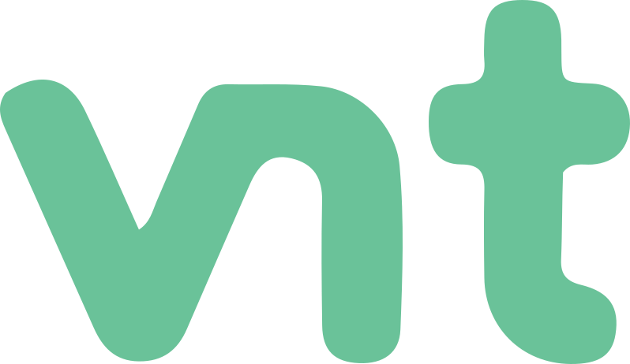

<div align="center">
  
  <h1>Vue Native Toolkit</h1>
</div>

### How is vnt native?

The term **native** in vnt does not mean that the components are rendered natively but instead refers to how they behave and how they are structured, trying to mimic the components of other native toolkits in multiple aspects.

### How to use vnt?

vnt is currently in early development and not yet published to npm. To use it, you can use this repository as a dependency in your package.json file.

```json
{
  "dependencies": {
    "vnt": "git+https://github.com/mirkobrombin/vnt.git"
  }
}
```

and then run `npm install` or `pnpm install` to install the package and its dependencies.

In your Vue project, you can use vnt as a plugin in your entry file.

```javascript
import { createApp } from "vue";
import App from "./App.vue";
import vnt from "vnt";

const app = createApp(App);
app.use(vnt);
app.mount("#app");
```

### How to make desktop apps with vnt?

The idea is to use vnt together with tools like [Tauri](https://tauri.app/), [Wails](https://wails.io/) or [Electron](https://www.electronjs.org/). Currently only Tauri is officially supported, but the other two should work as well with some caveats.

### Is vnt for desktop apps only?

No, vnt is designed to be used in any Vue.js project, including web apps and mobile apps.

## Documentation

To be written.

## License

vnt is licensed under the GPL-3.0 license. Some of the assets used in the project may have different licenses, for example the [Noto Sans](https://fonts.google.com/noto/specimen/Noto+Sans/about) and the [Material Symbols](https://fonts.google.com/icons?icon.set=Material+Icons) fonts. Please refer to the respective licenses for more information.
